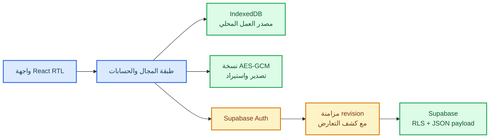

# معمارية aqsaty

يوضح هذا المستند حدود البيانات المحلية ومسار المزامنة الاختيارية. **IndexedDB** هو مصدر العمل المحلي، بينما Supabase طبقة مزامنة مشروطة بالمصادقة والاتصال.



## قواعد التشغيل

1. تحفظ العمليات محليًا أولًا حتى عند انقطاع الإنترنت.
2. لا ترفع صور المنتجات إلى السجل السحابي؛ تبقى محلية لتقليل حجم البيانات الحساسة.
3. لا تُنفّذ الكتابة السحابية إذا تغيّر `revision` منذ آخر سحب ناجح.
4. يجب أخذ نسخة احتياطية مشفرة قبل الاستيراد أو إعادة الضبط.
5. يجب تهيئة سياسات RLS وإضافة المستخدم إلى Workspace قبل تفعيل المزامنة.

## أوامر الجودة

```bash
npm run lint
npm run check
npm test
npm run build
```

لا تضع `service_role` أو أي سر خاص داخل ملفات الواجهة أو المستودع. استخدم متغيرات البيئة المحلية وأسرار GitHub عند الحاجة.
